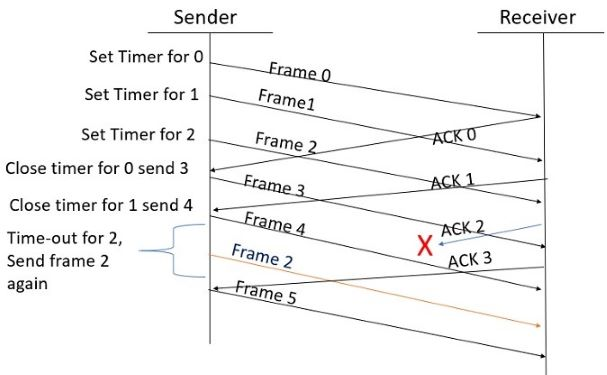
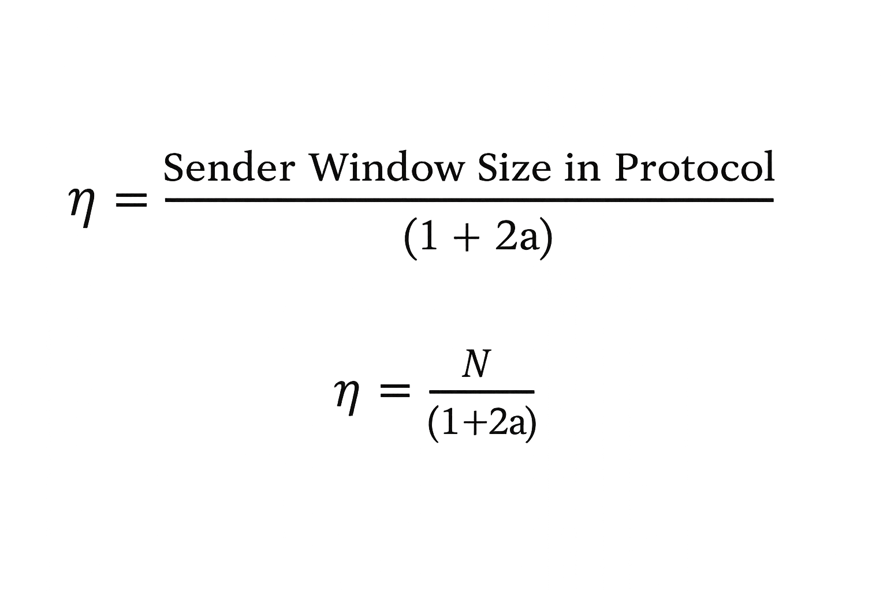
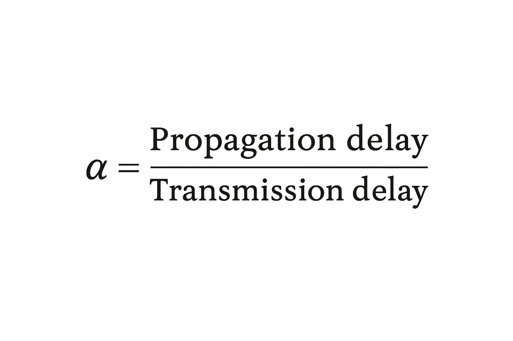

### Introduction

Flow Control is a set of procedures for the Data Link Layer that controls the flow of data between the sender and the receiver. It allows two stations working at different speeds to communicate with each other. It is a set of measures taken to regulate the data that the Sender sends to receiver, so that no problem is faced if the sender sends data at higher rate and receiver is too slow to support that data rate. To solve the above problem, FLOW CONTROL is introduced in Data Link Layer. It tells the sender how much data should be sent to the receiver so that the data is not lost. The main concept of Flow Control is to introduce EFFICIENCY in Computer Networks. To help in it, there are various flow control protocols which are classified as:-

 
 
 <figcaption><strong>Fig. 1 Flow Control Protocols</strong></figcaption>  
 

  

The protocols in the first category cannot be used in real life, but they serve as a basis for understanding the protocols of noisy channels.

All the protocols we will discuss are unidirectional in the sense that the data frames travel from one node, called the sender, to another node, called the receiver. Although special frames, called acknowledgment (ACK) and negative acknowledgment (NACK) can flow in the opposite direction for flow and error control purposes, data flow in only one direction. In a real-life network, the data link protocols are implemented as bidirectional; data flow in both directions. In these protocols the flow and error control information such as ACKs and NACKs is included in the data frames in a technique called piggybacking. Because bidirectional protocols are more complex than unidirectional ones, we chose the latter for our discussion.

### Selective Repeat Protocol

Selective Repeat is part of the automatic repeat request (ARQ). The go-back-n protocol works well if errors are less, but if the line is poor it wastes a lot of bandwidth on retransmitted frames. An alternative strategy, the selective repeat protocol, is to allow the receiver to accept and buffer the frames following a damaged or lost one. Selective Repeat attempts to retransmit only those packets that are actually lost (due to errors):

- Receiver must be able to accept packets out of order.
- Since receiver must release packets to higher layer in order, the receiver must be able to buffer some packets.

### This protocol involves the following transitions:

- In this protocol, Sender’s Windows (Ws) = Receiver’s Windows (Wr). The size of the sliding window is always greater than 1.
- A sender can send multiple frames as allowed by the window size.
- The receiver sends the acknowledgement for each frame.
- If the acknowledgement for a particular frame is not received, then the sender resends that frame again without disturbing the flow of others.
- The receiver side, if the frame received is corrupted, then the receiver can send a negative acknowledgement (NAK/NACK).
- When negative acknowledgement is received by the sender, then that particular frame is re-sent similarly.
- In this protocol, the size of the sender and receiver window must be at most one-half of 2^m where m is the size of the sequence number field in bits.

### Example of Selective Repeat ARQ:
  

                    
  
  <figcaption><strong>Fig. 2 Working of Selective Repeat ARQ</strong></figcaption>

 

### Explanation:

Step 1: Frame 0 sends from sender to receiver and set timer.

Step 2: Without waiting for acknowledgement from the receiver another frame, Frame1 is sent by sender by setting the timer for it.

Step 3: In the same way frame 2 is also sent to the receiver by setting the timer without waiting for previous acknowledgement.

Step 4: Whenever sender receives the ACK0 from receiver, within the frame 0 timer then it is closed and sent to the next frame, frame 3.

Step 5: whenever the sender receives the ACK1 from the receiver, within the frame 1 timer then it is closed and sent to the next frame, frame 4.

Step 6: If the sender doesn’t receive the ACK2 from the receiver within the time slot, it declares timeout for frame 2 and resends the frame 2 again, because it thought the frame2 may be lost or damaged.

### **Few Terminologies:**

**1. Transmission Delay (Tt)**: Time to transmit the packet from host to the outgoing link.

Where,  
- **D**: Data Size to transmit
- **B**: Bandwidth of the link
 

**2. Propagation Delay (Tp)** : It is the time taken by the first bit transferred by the host onto the outgoing link to reach the destination. 

where
- **d** : distance,</li>
- **s** : the wave propagation speed (depends on the characteristics of the medium).
   
**3. Efficiency of GBN (η)**

 
where,     

  

### Advantages

- It can send multiple frames at once.
- Fewer transmission.

### Disadvantages

- More complexity at sender and receiver side.
- Each frame must be acknowledged individually (no cumulative acknowledgements).
- Receiver may receive frames out of sequence.